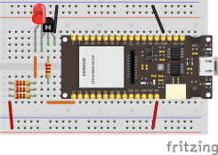

# ESP-ARC452A21
ESP32 implementation of an IoT-enabled remote control based on the Daikin ARC452A21 to control Daikin air conditioners and heat pumps.

## ESP-IDF build

This repository is structured as a normal ESP-IDF project:

- `main/` starts the firmware.
- `components/ir_capture/` owns the RMT receive path for learning Daikin IR frames.
- `components/daikin_ir/` owns the RMT transmit path for blasting Daikin IR frames.

Default pins:

- IR receiver input: `GPIO16`
- IR blaster output: `GPIO17`
- IR activity RGB LED data: `GPIO5`

## Circuit



IR transmit wiring uses GPIO17 as an active-high transistor drive. The IR LED is
switched through a low-side transistor to ground, so the normal firmware default
is `invert_out=0`: GPIO high turns the LED carrier on, GPIO low turns it off.
The GPIO5 WS2812 RGB LED turns on during each IR transmit burst and clears when
the send finishes.

Build and flash:

```sh
. tools/use-idf-5.5.sh
idf.py set-target esp32
idf.py build
idf.py flash monitor
```

The project is pinned to ESP-IDF 5.x. The helper above sources the installed
ESP-IDF 5.5.4 toolchain, and CMake fails early if the project is configured with
ESP-IDF 6.x or newer.

This project is configured for ESP32 boards with 4 MB flash. The custom
partition table keeps NVS and PHY data at the default offsets and gives the
single factory app partition the rest of flash, leaving enough room for the
embedded web UI and remote-control protocols.

Remote testing can be configured at build time, or through the fallback setup
portal. Set these with `idf.py menuconfig` under `ESP-ARC452A21 Remote Control`
if you already know the WiFi network:

```text
WiFi SSID
WiFi password
WiFi connection retries
Setup portal AP SSID       # default: ESP-ARC452A21-Setup
Setup portal AP password   # optional; empty means open setup AP
MQTT broker URI              # optional, e.g. mqtt://192.168.1.20:1883
MQTT topic prefix            # default: esp-arc452a21
```

If the ESP32 has no saved SSID, or it cannot connect after the configured retry
count, it starts a captive setup portal. Join the `ESP-ARC452A21-Setup` WiFi
network and open:

```text
http://192.168.4.1/
```

Open `/settings` to save WiFi credentials. The firmware keeps up to three saved
networks in NVS; saving a fourth distinct SSID overwrites the oldest slot. Saving
an existing SSID updates that slot. After saving WiFi, the ESP32 restarts and
tries the saved networks before opening the setup portal again. The root page `/`
is the lightweight AC control surface.

The root page `/` is the AC control surface and shows the current firmware state
as the last sent settings. Temperature controls appear only for auto, cool, and
heat modes. Changes made on the root page are sent automatically. The settings
page also exposes the temperature unit and live IR blaster parameters:

```text
Temperature unit: Fahrenheit | Celsius
Polarity: normal | invert
Timing: nominal | captured
Repeat count and repeat gap
```

Display unit and IR blaster settings are saved in NVS and restored on reboot.

MQTT can also be configured from `/settings`:

```text
MQTT access       # on/off; saved setting controls whether the client starts
Broker IP/URI      # e.g. 192.168.1.20 or mqtt://192.168.1.20:1883
Subscribe topic    # incoming commands, e.g. esp-arc452a21/command
Publish topic      # JSON command results, e.g. esp-arc452a21/status
```

If the broker field is an IP address without a scheme, the firmware stores it as
`mqtt://<ip>:1883`. Saved MQTT settings override the build-time MQTT URI and
topic prefix.

## HomeKit

The firmware can also advertise as an uncertified HomeKit accessory using
Espressif's HomeKit SDK. Initialize the submodule before building:

```sh
git submodule update --init --recursive
```

After flashing, add the accessory from the Apple Home app. Choose the
manually-listed `ESP-ARC452A21` accessory and use setup code:

```text
111-22-333
```

HomeKit runs its HAP HTTP server on port `5556` so the normal web UI can keep
using port `80`. A direct unauthenticated probe of the HAP endpoint should return
an authorization-required HAP response:

```sh
curl -i "http://<esp-ip>:5556/accessories"
```

HomeKit exposes the device as one heat-pump/air-conditioner accessory with
power, auto/heat/cool target mode, target temperature, fan speed, temperature
display unit, and vertical swing. The current temperature shown to HomeKit is
synthetic and follows the target temperature until a real room-temperature sensor
is added. Daikin-specific extras that HomeKit does not model cleanly, including
horizontal swing, Quiet, Comfort, and Intelligent Eye, remain available through
the web UI, MQTT, and serial console instead of HomeKit.

The `/settings` page includes a HomeKit on/off toggle. Changing it saves the
setting in NVS and restarts the ESP32 so the HAP service can start or stop
cleanly.

## Matter

Matter support is scaffolded as an optional standalone accessory, not a bridge.
When enabled, the firmware creates a Matter Room Air Conditioner endpoint and
maps Matter writes through the same `ac_control_apply_state()` path used by the
web UI, MQTT, and HomeKit. The planned Matter surface is power, heat/cool/auto
system mode, target setpoint, fan speed/auto, temperature display unit, and
horizontal/vertical swing through the Fan Control Rocking feature.

Matter is disabled by default because ESP-Matter brings in the full Matter/CHIP
stack and needs a separate size/runtime validation pass on this 4 MB ESP32
build:

```text
CONFIG_ESP_ARC452A21_MATTER_ENABLE=n
```

To try a Matter-enabled build, initialize ESP-Matter with Espressif's
platform-specific checkout flow instead of a full recursive submodule checkout:

```sh
git submodule update --init external/esp-matter
cd external/esp-matter
git submodule update --init --depth 1
cd connectedhomeip/connectedhomeip
./scripts/checkout_submodules.py --platform esp32 darwin --shallow
cd ../..
./install.sh --no-host-tool
cd ../..
```

Then opt in to the Matter components and enable the Kconfig option:

```sh
export ESP_ARC452A21_ENABLE_MATTER=1
. tools/use-idf-5.5.sh
idf.py menuconfig    # enable ESP-ARC452A21 Remote Control > Matter
idf.py build
```

The `release/v1.4.2` ESP-Matter branch currently recommends ESP-IDF v5.4.1.
This project remains pinned to the installed ESP-IDF 5.5.4 toolchain, so treat
Matter as experimental until the Matter-enabled image is built, flashed, and
commissioned successfully.

With WiFi enabled, the firmware also starts a small HTTP API:

```sh
curl "http://<esp-ip>/health"
curl "http://<esp-ip>/send?cmd=72"
curl -X POST "http://<esp-ip>/command" --data-binary "off 72"
```

With MQTT enabled, publish serial-console commands to
`esp-arc452a21/command` and read JSON responses from `esp-arc452a21/status`.
The retained availability topic is `esp-arc452a21/availability`.

The current firmware initializes both RMT channels: the receiver listens on
`GPIO16`, and the transmitter drives the IR blaster on `GPIO17`. Type a
temperature in the serial monitor to transmit a frame; any frame seen by the
receiver is printed as an `IR_CAPTURE_*` block in the same monitor. Fahrenheit is
the default input unit, and Celsius inputs can be entered with a `c` suffix or
with `unit celsius`.
For the combined transmit/capture test, RX uses a 384-symbol RMT hardware block
so there is still enough RMT memory left for the TX channel. The software
capture buffer remains 2048 symbols.

```text
daikin> 72
daikin> temp 22 c
daikin> unit celsius
daikin> off 72
daikin> mode heat
daikin> fan auto
daikin> vswing on
daikin> hswing off
daikin> quiet on
daikin> sensor eye
daikin> polarity invert
daikin> repeat 1 80
daikin> timing nominal
daikin> loopback clear
daikin> send
```

Each command updates the current remote state and then sends the full state
frame. `72` and `on 72` set power on with the requested Fahrenheit target;
`22c` and `temp 22 c` set a Celsius target. `off 72` sends the same target with
the power bit clear, matching the complete off-state captures. Type `help` in
the monitor for the full command list. If a receiver sees clean frames but the
indoor unit does not respond, check the IR LED drive polarity/transistor wiring
first.

The transmitter sends each frame once by default. At boot it logs
the current output polarity:

```text
invert_out=0 carrier_active_low=0 repeat=1 gap=80 ms timing=nominal
```

If the AC does not react, validate in this order:

1. Look at the IR LED through a phone camera while sending `72`. Many phone
   cameras show a faint purple/white blink if the LED is actually emitting.
2. If using an active-low IR blaster module, try setting
   `polarity invert` in the serial monitor, then send `72` again. Use
   `polarity normal` to switch back.
3. Try `repeat 3 80` if the unit needs multiple full-frame repeats. Use
   `repeat 1 80` to restore the default.
4. Try `timing captured` to compare against the demodulated timings measured
   from the receiver captures. Use `timing nominal` to switch back to the
   default.
5. With the receiver on `GPIO16`, capture your generated `off 72` frame. It
   should decode section 3 as:

```text
11 DA 27 00 00 38 2C 00 50 00 00 06 60 00 00 C1 80 00 6D
```

For `on 72`, the expected section 3 is:

```text
11 DA 27 00 00 39 2C 00 50 00 00 06 60 00 00 C1 80 00 6E
```

If boot fails with `rmt_new_tx_channel(...): no free tx channels`, the RX
hardware block is too large for simultaneous RX and TX. Keep the combined-test
RX block at 384 symbols or lower, or disable RX while transmitting.

## Saving captures

The firmware prints every IR frame as a machine-readable block. The first value
after `IR_CAPTURE_BEGIN` is the number of symbols received; the second is the
configured capture buffer capacity.

When the ESP32 transmits, it arms a one-shot loopback expectation for the next
complete Daikin-sized capture. With the transmitter and receiver aimed at each
other, a healthy loopback looks like:

```text
DAIKIN_LOOPBACK_EXPECT,1
DAIKIN_TX_SECTION_1,11,DA,27,00,C5,00,00,D7
DAIKIN_TX_SECTION_2,11,DA,27,00,42,00,10,64
DAIKIN_TX_SECTION_3,11,DA,27,00,00,39,2C,00,50,00,00,06,60,00,00,C1,80,00,6E
...
DAIKIN_CAPTURE_SECTION_3,11,DA,27,00,00,39,2C,00,50,00,00,06,60,00,00,C1,80,00,6E
DAIKIN_LOOPBACK_RESULT,match,sequence=1,section1=ok,section2=ok,section3=ok
```

If the result is `mismatch`, the receiver decoded a different payload than the
one the transmitter intended. If it is `no_expected`, the capture came from the
original remote or from a previous expectation that had already been consumed.
Use `loopback clear` before capturing the original remote if a stale expectation
is confusing the log.

When a complete Daikin-sized frame is captured, the firmware also prints decoded
payload lines before the raw symbols:

```text
DAIKIN_CAPTURE_SECTION_3,11,DA,27,00,00,39,2C,00,50,00,00,06,60,00,00,C1,80,00,6E
DAIKIN_CAPTURE_FIELDS,mode_power=39,temp=2C,fan_vswing=50,hswing=00,quiet=00,sensor=80,checksum=ok
```

Every ESP transmit prints the intended payload as `DAIKIN_TX_SECTION_3`. For a
healthy self-capture, `DAIKIN_TX_SECTION_3` and `DAIKIN_CAPTURE_SECTION_3`
should match exactly. If they match but the indoor unit still ignores the frame,
focus on IR LED drive strength, alignment, and carrier/polarity hardware rather
than byte mapping.

```text
IR_CAPTURE_CONFIG,1,2048,512
IR_CAPTURE_BEGIN,292,2048
IR_CAPTURE_SYMBOL,0,1,3500,0,1750
...
IR_CAPTURE_END
```

Use the capture helper to save each button press as a CSV file:

```sh
python tools/capture_serial.py --port /dev/cu.usbserial-0001 --label cool_22_auto
```

Replace the port with your ESP32 serial port. On macOS it is usually one of:

```sh
ls /dev/cu.*
```

You can also save a pasted or redirected monitor log:

```sh
python tools/capture_serial.py --input-file monitor.log --label cool_22_auto
```

For guided protocol capture, use the wizard:

```sh
python tools/capture_wizard.py --port /dev/cu.usbserial-0001
```

To decode saved complete captures and verify the known field mappings:

```sh
python tools/validate_daikin_captures.py captures
```

The wizard walks through the important ARC452A21 states, tells you how to set up
the remote for each capture, saves each frame as CSV, and records the intended
state/action in `captures/manifest.jsonl`. Preview the plan with:

```sh
python tools/capture_wizard.py --port dummy --list
```

Suggested labels:

- `off`
- `auto_22_fan_auto`
- `dry_22_fan_auto`
- `cool_18_fan_auto`
- `cool_22_fan_auto`
- `cool_32_fan_auto`
- `cool_18c_fan3_swing_off_down_at_min`
- `cool_19c_fan3_swing_off_up_from_min`
- `cool_22c_fan3_swing_off`
- `cool_32c_fan3_swing_off`
- `cool_32c_fan3_swing_off_up_at_max`
- `heat_22_fan_auto`
- `fan_only_fan_auto`
- `cool_22_fan_1` through `cool_22_fan_night`
- `cool_22_swing_vertical_on`
- `cool_22_swing_horizontal_on`
- `cool_22_quiet_on`
- `cool_22_sensor_comfort`
- `cool_22_sensor_eye`
- `cool_22_sensor_both`
- `cool_22_sensor_off`

If the firmware logs `Capture filled the ... buffer`, repeat that capture after
increasing `IR_CAPTURE_MAX_SYMBOLS` in `components/ir_capture/include/ir_capture.h`.
A capture that ends at the buffer limit is probably truncated. If new captures
still report `IR_CAPTURE_BEGIN,256` without an `IR_CAPTURE_CONFIG,1,2048,512`
startup line, reflash the ESP32 so it is running the current firmware. The
default hardware block is now 512 symbols and the capture buffer capacity is
2048 symbols.

## Decoded protocol notes

Current full captures are 292 RMT symbols and decode as three byte sections:

```text
section 1: 11 DA 27 00 C5 00 00 D7
section 2: 11 DA 27 00 42 00 10 64
section 3: 11 DA 27 00 00 [mode/power] [temp] 00 [fan/vswing] [hswing] 00 06 60 [quiet] 00 C1 [sensor] 00 [checksum]
```

Each section checksum is the low byte of the sum of the previous bytes in that
section. For example, section 3 checksum is:

```text
checksum = sum(section_3[0:-1]) & 0xFF
```

Known section 3 fields from the 2026-06-29 complete captures. The AC/remote
was off for most of this capture session; the first step toggled a switched-on
state to switched-off, so the complete captures mostly validate off-state
frames.

- Power appears to be bit `0x01` in the mode byte, but this still needs full
  on-state validation. Complete off captures use `0x08`, `0x28`, `0x38`,
  `0x48`, and `0x68`; earlier truncated on captures appeared as `0x09`,
  `0x29`, `0x39`, `0x49`, and `0x69`.
- Mode bases: auto `0x08`, dry `0x28`, cool `0x38`, heat `0x48`, fan-only
  `0x68`.
- Fahrenheit temperature byte appears to be `temperature_f - 28`, for example
  64 F `0x24`, 65 F `0x25`, 72 F `0x2C`, and 90 F `0x40`.
- Fan byte: speed 1 `0x30`, speed 2 `0x40`, speed 3 `0x50`, speed 4 `0x60`,
  speed 5 `0x70`, auto `0xA0`, night `0xB0`.
- Vertical swing appears to set the low nibble of the fan byte, for example
  night `0xB0` becomes vertical swing on `0xBF`.
- Horizontal swing byte: off `0x00`, on `0x0F`.
- Quiet byte: off `0x00`, on `0x20`.
- Sensor byte: no intelligent eye `0x80`, intelligent eye `0x82`.
- Comfort mode appears to select the `0xA0` airflow/fan value; comfort plus
  intelligent eye combines `0xA0` with sensor byte `0x82`.

The remote sends full state frames, not isolated button events. For example,
the complete `power_off` and `cool_64_fan3_hswing_down_at_min` captures are
byte-identical when the remote display state is identical.

Needs more validation:

- Capture full off-to-on and on-to-off ON/OFF toggle frames from known display
  states. We need to confirm whether only the mode byte low bit changes, and
  whether the remote display state after the toggle is what the frame reports.
- Capture at least one complete power-on frame for each mode: auto, dry, cool,
  heat, and fan-only. Current complete captures validate the off-state mode
  bases; earlier on-state captures were useful but truncated.
- Capture Celsius display mode. The CLI accepts Celsius inputs, but the encoder
  currently maps them through the known Fahrenheit-equivalent temperature byte
  until captures prove whether ARC452A21 has a separate Celsius unit flag. The
  wizard includes Celsius steps for 18 C, 19 C, 22 C, 32 C, and the min/max
  boundary frames.
- Capture dry and fan-only with multiple displayed temperatures/fan settings.
  The encoder currently uses the observed mode-specific sentinels: dry temp
  byte `0xC0` with fan auto `0xA0`, and fan-only temp byte `0x32`.
- Recapture comfort, intelligent eye, and comfort plus intelligent eye in a
  couple of fan modes. Comfort changing the fan byte to `0xA0` may be a feature
  flag, an airflow setting, or both.
- Validate generated transmit frames against the indoor unit before treating
  any byte map as final.

## Remote capability model

Temperature:

- Celsius range: `18 C` to `32 C`
- Fahrenheit range: `64 F` to `90 F`

Mode button cycle:

1. Auto
2. Dehumidifier / Dry
3. Cool
4. Heat
5. Fan only

Fan button cycle:

1. Fan speed 1
2. Fan speed 2
3. Fan speed 3
4. Fan speed 4
5. Fan speed 5
6. Fan speed auto
7. Fan speed night mode

Other controls to capture:

- Vertical swing on/off
- Horizontal swing on/off
- Quiet mode on/off
- Sensor mode: off, comfort operation, intelligent eye, comfort plus intelligent eye

Scheduling and timer functions are intentionally out of scope. Home Assistant, Matter, and HomeKit automations should own schedules.
